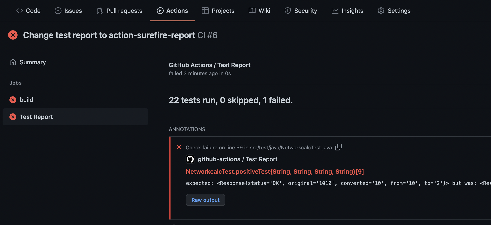

# rest_api_tests

To run tests you can use maven with command

````
mvn test 
````

Tests run automatically at the commit, the ***test report*** can be found in ***Actions*** tab -> appropriate workflow -> ***Test Report***

